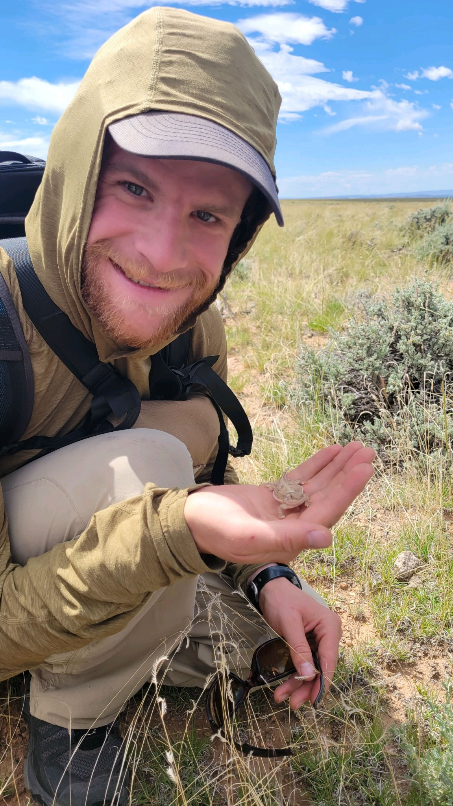

## Ethan Linck (PI)  

  

Ethan is a broadly trained biologist interested in the forces that shape the distribution of genetic variation and species, mostly in birds. This research program involves integrating natural history, population genomics, ecophysiology, and macroecology. He also likes to think about environmental ethics, and the societal role of biodiversity science and conservation. He grew up in Vermont (with a short but formative stint in Tucson), received a B.A. in Biology from Reed College in Portland, Oregon, and did his Ph.D. in the Department of Biology at University of Washington in Seattle. After grad school he was postdoc at University of Tennessee, Knoxville, University of New Mexico, and University of Wyoming. In his free time he likes to write, [run](https://elinck.org/running), backcountry ski, garden and mess with his bicycle or old trucks. [Click here](https://github.com/elinck/elinck_CV/blob/master/elinck_CV.pdf) for his CV, or [here](https://scholar.google.com/citations?user=9jNmRcsAAAAJ&hl=en) for his Google Scholar profile.

## Jason Gregg  

  

Jason joins the Linck Lab following a decade of working in applied conservation for NGOs and research consultancies including Point Blue Conservation Science, the Peregrine Fund, and Archipelago Research and Conservation. In 2022, he led an expedition in Papua New Guinea that successfully documented a critically endangered species [lost to science for more than one hundred years](https://www.jasonjgregg.com/lost-bird-found-bird), the Black-naped Pheasant-pigeon. As a new M.S. student, he is excited to continue researching the birds of the Southwest Pacific and gain new skills in conservation science. Jason’s publications and popular science writing can be seen on [his website](https://www.jasonjgregg.com/).

## Lizzy Osterhoudt 

  

Lizzy joined the Linck Lab in the Fall of 2024 after graduating from Colorado State University with a B.S. in Zoology earlier that year. Her time at CSU was dedicated to supporting the local Native American youth population through tutoring, mentoring, and other community events. In 2023, she became a McNair Scholar, exploring the stress physiology of Wyoming Ground Squirrels in a changing climate under the perspective of Native science. Additionally, she led a project in collaboration with CSU's Native American Cultural Center that explored the riparian species diversity of Northern Colorado with Native science. She hosted a session at the National Annual Native American Fish and Wildlife Society's meeting in 2024, discussing her research which received third overall in poster presentations. She obtained a grant from Trees, Water, and Peoples nonprofit organization to finish her project post-graduation before moving to Montana. She is excited to begin working with the Pika populations from her ancestral homelands of Jemez, New Mexico, and integrating Native science into her PhD project.

## Owen Kanter 

Owen is interested in applied wildlife conservation research with a focus on threatened and endangered species. He is investigating the genetics and movement ecology of swift foxes on the Fort Belknap Indian Reservation in northeastern Montana. He is coadvised by Dr. Ethan Linck and Dr. Justine Becker, and the project is a collaboration with the Smithsonian Institution National Zoo and Conservation Biology Institute and Fort Belknap Fish and Wildlife Department. Owen grew up in New Hampshire where he achieved his B.S. in Wildlife and Conservation Biology from the University of New Hampshire. Following completion of his degree, Owen moved to the intermountain west where he has spent the past five years working for state nongame wildlife departments. Highlights from those five years include two summers of alpine surveys in Idaho studying Black Rosy-Finches, a winter of camera-trapping for wolverines in Wyoming, and two years leading nongame wildlife projects for Montana Fish, Wildlife and Parks, including a pygmy rabbit occupancy study. When he is taking a break from graduate work, Owen can be found fishing, floating, hunting, and skiing with his partner Morgan and their two pups, Aspen and Gale.

## Nate Ingelfinger  

  

Nate joined the Linck Lab in the spring of 2025. He is currently pursuing an undergraduate degree in Conservation Biology with a minor in Geographical Information Systems at Montana State University. Originally from Whitefish Montana, Nate is an avid backcountry skier, climber, and trail runner. These experiences sparked his interest in the natural world and the threats posed by climate change, specifically how it is altering species' distribution and abundance. Nate is excited to gain hands-on experience in the lab and to deepen his understanding of scientific research. 
 
 
## Lab Alumni  

- Finn Addison (Research Assistant, 2025)  

## You?  

Please see the [opportunities page](https://elinck.org/opportunities) for current openings in the lab.  
