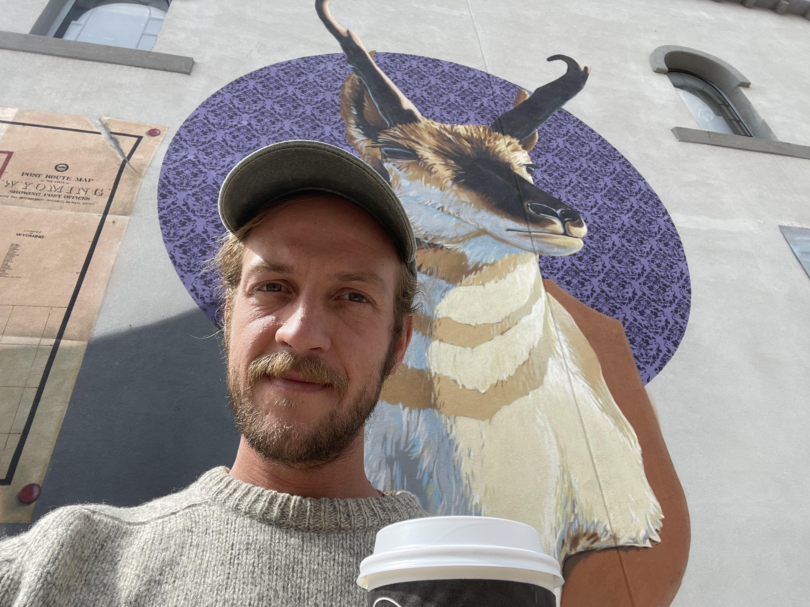
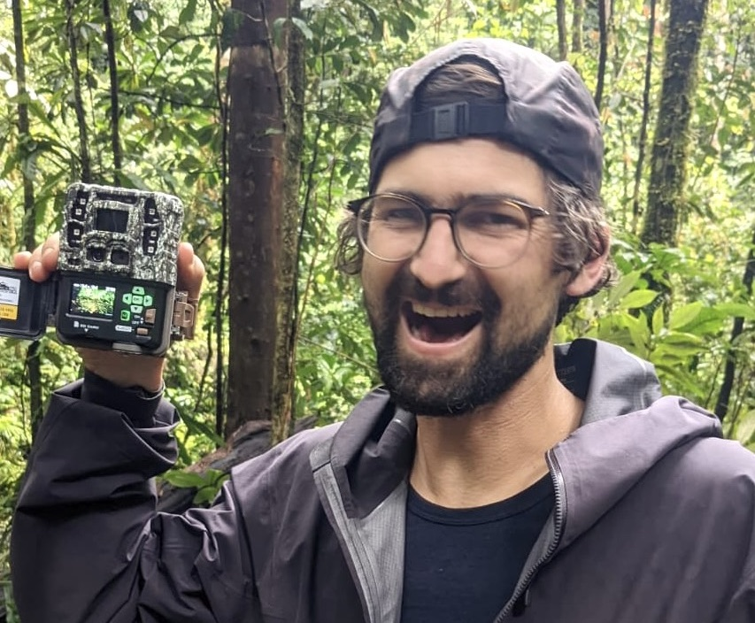

## Ethan Linck (PI)

  

I'm a broadly trained biologist interested in the forces that shape the distribution of genetic variation and species, mostly in birds. This research program involves integrating natural history, population genomics, ecophysiology, and macroecology. I also like to think about environmental ethics, and the societal role of biodiversity science and conservation. I grew up in Vermont (with a short but formative stint in Tucson), received a B.A. in Biology from Reed College in Portland, Oregon, and did my Ph.D. in the Department of Biology at University of Washington in Seattle. After grad school I was postdoc at University of Tennessee, Knoxville, University of New Mexico, and University of Wyoming. In my free time I like to write, [run](https://elinck.org/running), backcountry ski, garden and mess with my bicycle or old trucks. [Click here](https://github.com/elinck/elinck_CV/blob/master/elinck_CV.pdf) for my CV, or [here](https://scholar.google.com/citations?user=9jNmRcsAAAAJ&hl=en) for my Google Scholar profile.

## Jason Gregg

Jason Gregg joins the Linck Lab following a decade of working in applied conservation for NGOs and research consultancies including Point Blue Conservation Science, the Peregrine Fund, and Archipelago Research and Conservation. In 2022, he led an expedition in Papua New Guinea that successfully documented a critically endangered species [lost to science for more than one hundred years](https://www.jasonjgregg.com/lost-bird-found-bird), the Black-naped Pheasant-pigeon. As a new M.S. student, he is excited to continue researching the birds of the Southwest Pacific and gain new skills in conservation science. Jason’s publications and popular science writing can be seen on [his website](https://www.jasonjgregg.com/).

## You?

Please see the [opportunities page](https://elinck.org/opportunities) for current openings in the lab.
