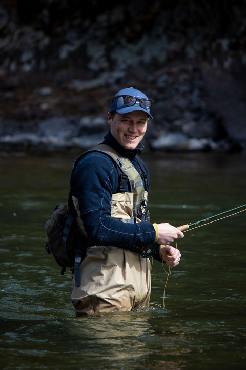

## Ethan Linck (PI)  

  

Ethan is a broadly trained biologist interested in the forces that shape the distribution of genetic variation and species, mostly in birds. This research program involves integrating natural history, population genomics, ecophysiology, and macroecology. He also likes to think about environmental ethics, and the societal role of biodiversity science and conservation. He grew up in Vermont (with a short but formative stint in Tucson), received a B.A. in Biology from Reed College in Portland, Oregon, and did his Ph.D. in the Department of Biology at University of Washington in Seattle. After grad school he was postdoc at University of Tennessee, Knoxville, University of New Mexico, and University of Wyoming. In his free time he likes to write, [run](https://elinck.org/running), backcountry ski, garden and mess with his bicycle or old trucks. [Click here](https://github.com/elinck/elinck_CV/blob/master/elinck_CV.pdf) for his CV, or [here](https://scholar.google.com/citations?user=9jNmRcsAAAAJ&hl=en) for his Google Scholar profile.

## Jason Gregg  

  

Jason joins the Linck Lab following a decade of working in applied conservation for NGOs and research consultancies including Point Blue Conservation Science, the Peregrine Fund, and Archipelago Research and Conservation. In 2022, he led an expedition in Papua New Guinea that successfully documented a critically endangered species [lost to science for more than one hundred years](https://www.jasonjgregg.com/lost-bird-found-bird), the Black-naped Pheasant-pigeon. As a new M.S. student, he is excited to continue researching the birds of the Southwest Pacific and gain new skills in conservation science. Jason’s publications and popular science writing can be seen on [his website](https://www.jasonjgregg.com/).

## Lizzy Osterhoudt 

  

Lizzy joined the Linck Lab in the Fall of 2024 after graduating from Colorado State University with a B.S. in Zoology earlier that year. Her time at CSU was dedicated to supporting the local Native American youth population through tutoring, mentoring, and other community events. In 2023, she became a McNair Scholar, exploring the stress physiology of Wyoming Ground Squirrels in a changing climate under the perspective of Native science. Additionally, she led a project in collaboration with CSU's Native American Cultural Center that explored the riparian species diversity of Northern Colorado with Native science. She hosted a session at the National Annual Native American Fish and Wildlife Society's meeting in 2024, discussing her research which received third overall in poster presentations. She obtained a grant from Trees, Water, and Peoples nonprofit organization to finish her project post-graduation before moving to Montana. She is excited to begin working with the Pika populations from her ancestral homelands of Jemez, New Mexico, and integrating Native science into her PhD project.

## Finn Addison  

  

Finn joined the Linck Lab as a research assistant after graduating from Montana State in the fall of 2024 with a B.S. in Conservation Biology and Ecology and a minor in Genetics. Finn’s previous genetics experience comes from a culmination of coursework and jobs in plants, microbes, and fisheries genetics with work in an MSU Plant Pathology Lab, as a Fisheries Technician for Turner Enterprises, and at the Norwegian University of Life Sciences where his studies focused on sustainable genetics of aquaculture. Joining the lab, Finn hopes to better understand how genetics can be applied to conservation work and gain proficiency in the lab and field setting.  

## You?  

Please see the [opportunities page](https://elinck.org/opportunities) for current openings in the lab.  
