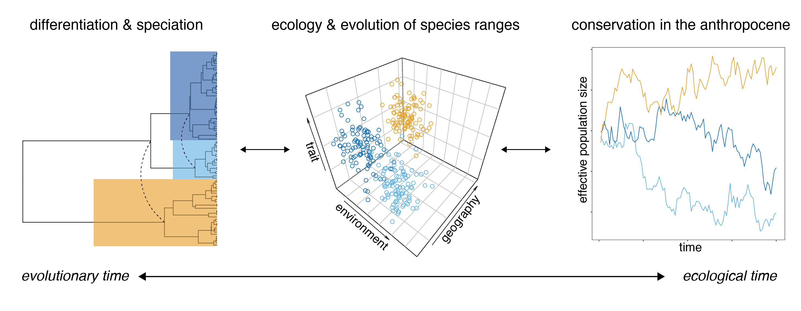

We are biologists broadly interested in the forces that shape the distribution of species, genetic variation, and traits. Understanding biogeographic patterns at any level of biological organization requires linking historical processes (like speciation) with present-day ecological realities (like habitat fragmentation or temperature). It also provides the basis for management interventions and forecasting responses to future climate warming.  

  

Our work spans ecology, population genomics and phylogenetics, and physiology. We value natural history museums and natural history, reproducibility and best practices in scientific programming, and writing clearly about science for diverse audiences. We are particularly interested in work that falls in overlap of conceptual issues in ecology and evolution and meaningful conservation.

### Genetic differentiation and gene flow in mountains  

Mountains are biodiversity hotspots. They are also geographically complex landscapes with pronounced environmental gradients over small spatial scales. Do distinct populations and new species primarily arise from random neutral divergence across geographic barriers or by adaptive divergence into new ecological niches? We've addressed this question by 1) using genomic data to test a hypothesis of parapatric speciation in kingfisher taxa inhabiting different niches [(Linck et al. 2020, *J. Evol. Biol.*)](https://doi.org/10.1111/jeb.13698) and 2) modeling how climatic cycles drive population divergence in the face of periodic gene flow ([Linck & Battey 2019, *bioRxiv*)](https://doi.org/10.1101/758664). Our lab also has longstanding interest in the phylogeography and systematics of montane species complexes ([e.g., Linck et al. 2019, *Syst. Biol.*](https://doi.org/10.1093/sysbio/syz027)).  

### Ecology and evolution of species ranges  

Distributions are clearly correlated with environmental variables like temperature and oxygen availability, but the extent to which genetic and physiological constraints influence range limits in endotherms remains an open question. We have found that plasticity and variation in functional traits predicted elevational range breadth in [100+ Andean bird species](https://doi.org/10.1101/2021.09.30.462673), and continue to study the genetic basis for adaptations to hypoxia within a subset of them. We're now expanding our interest in the intersection of ecophysiology and population genetics in a collaboration with colleagues at University of Montana and CU Boulder to understand how metabolism and admixture shape distributions and species limits in chickadees across a latitudinal gradient.  

### Biological responses to climate warming  

Anthropogenic climate warming is a grim global experiment in the forces shaping species ranges. Predicting its effect is a grand biological challenge of the 21st century. Adopting an evolutionary perspective is crucial to this task: specifically, that if takes millennia for tropical species to evolve into new climatic zones, there is little reason to expect them to rapidly adapt to novel temperature regimes [(Linck et al. 2022, *Biol. Lett.*)](https://doi.org/10.1098/rsbl.2021.0363). We've also worked to better understand where species are moving upslope the fastest [(Mamantov et al. 2021. *Glob. Ecol. Biogeog.*)](https://doi.org/10.1111/geb.13246), and helped to develop community science initiatives to improve our baseline monitoring of avian elevational distributions—a project that was recently featured on the front page of the [*Albuquerque Journal*](https://www.abqjournal.com/2410406/birding-with-a-purpose-ex-project-enlists-nm-watchers-to-help-researchers-examine-mountain-population-changes.html).  

[back](./)
