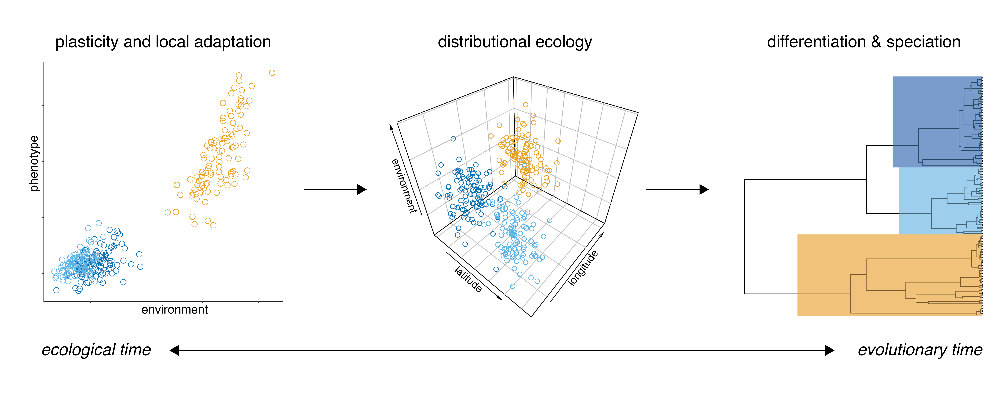

I'm an integrative evolutionary biologist and ecologist. Most of what I work on has something to do with *biogeography*, broadly defined: the study of why species live where they do. I like thinking about species ranges because they link the historical processes of speciation and population divergence with the way organisms interact with their environments today—and have a lot to say about their future on a warming planet.

My research involves natural history museums, field work, genomics, physiology, and statistical models. It is data intensive, and I try and emphasize computational reproducibility. Just as important to me as my formal research output is my popular writing about what science does and does not mean for the world we live in.

I usually work on projects related to one of the following three questions:

### What does the history of montane biodiversity say about its future?

Mountains feature strong climatic gradients. They are also biodiversity hotspots. These observations are clearly related, but exactly *how* they are related remains difficult to summarize. One possibility is that that adaptation to different climatic zones promotes parapatric speciation. My dissertation research indicates [this is almost never true](https://doi.org/10.5061/dryad.4f4qrfj9b) (at least in birds). Another possibility is that clinging to a particular environmental niche through cycles of climatic change drives population divergence on isolated mountainsides. This seems more likely, and some of [our ongoing modeling work](https://doi.org/10.1101/758664) suggests periodic "bursts" of gene flow don't do much to slow down speciation. These findings contribute to an emerging consensus about where montane biodiversity comes from. But the past is never dead, and my colleagues and I recently argued that speciation history tells us something important about the future: that if takes a long time for tropical species to evolve into new climatic zones, there is little reason to expect them to rapidly adapt to new temperatures under climate warming (in press, *Biology Letters*). The mechanisms limiting climate adaptation are a future emphasis of my research program. In the mean time, I'm helping to set up a global network tracking shifts in the distributions of montane birds—work that was recently the focus of [a front-page story in the *Albuquerque Journal*](https://www.abqjournal.com/2410406/birding-with-a-purpose-ex-project-enlists-nm-watchers-to-help-researchers-examine-mountain-population-changes.html).

*Population genetic structure and phylogenetic relationships in* Syma.  

### How do physiology and genetics shape species ranges?

A trivial but deceptively profound fact is that if species had no range limits, there would be no geographic variation in biodiversity (and I would be out of a job). Unfortunately, figuring out what *causes* range limits [is really hard](https://ethanlinck.substack.com/p/species-ranges-as-a-quintessential), in the way many classic biological questions are really hard—there are many variables at play, the answer depends on what scale you are asking the question, et cetera. In the species-rich tropics, we tend to assume interactions with other species are more important than abiotic variables like temperature or precipitation. As a result, we know surprisingly little about how physiology and genetics constrain where species live and where they don't. During graduate school, I wrote several papers describing phylogeographic patterns in widespread bird species (like [this](http://orcid.org/0000-0002-9958-4282), [this](https://doi.org/10.1111/1755-0998.12995) and [this](https://doi.org/10.1093/sysbio/syz027)), and became interested in theories that linked genetic variation to the evolution of species ranges, such at [gene swamping](https://doi.org/10.1016/S0169-5347(02)02497-7). Consequently, my first postdoc with Kimberly Sheldon included a paper [describing genetic variation](https://doi.org/10.1002/ece3.6185) across the elevational ranges of a set of thermally sensitive dung beetle species, which had no clear interpretation but pushed me further down the road of speculating about connections between genomes and functional traits and species distributions. My current work with Chris Witt and colleagues at UNM is tackling this problem from another angle, and asks whether plasticity in respiratory physiology is related to elevational distributions in Andean birds. The next step is to reintegrate genomics into the picture, and I'm excited to see what we find.  

*Plasticity in blood phenotype in Andean sierra finches*  

### What does science have to say about how we value the natural world?

I study biodiversity because it is interesting to me and I value it: I believe that the strange and wonderful species on our planet have inherent worth even if they have no direct use or cultural significance to us. I also like to think that the research I do produces knowledge that is useful to the broader world, and especially to conservationists and policy makers. But not every one shares my belief that biodiversity is an end unto itself, and most of my research findings are beside the point when we're confronted with management decisions and environmental crises that hinge on competing value systems, not empirical truth. I regularly grapple with the gray area where science butts up against society and environmentalism in [my newsletter treethinking](https://ethanlinck.substack.com/) and long-form essays for national magazines. In the past few years, I’ve written about [tensions between recreation and conservation](https://www.hcn.org/issues/50.8/recreation-your-stoke-wont-save-us) and [democracy and wolf reintroduction](https://www.hcn.org/issues/52.3/south-wolves-colorado-throws-wolves-to-the-vote) for *High Country News* and reported on [community conservation initiatives in Papua New Guinea](https://www.biographic.com/where-the-rainforest-meets-the-road/) as a photojournalist for *bioGraphic*.

[back](./)
